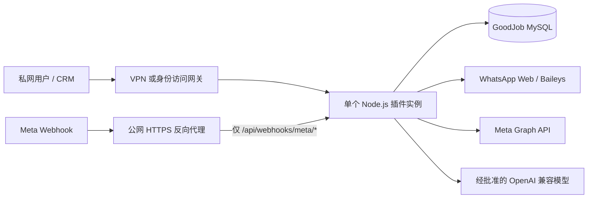

# WhatsApp CRM 插件生产部署与运维手册

## 1. 适用范围

本文适用于当前 `0.1.0` 版本。它只支持以下部署定位：

> 单租户、单实例、私网部署的生产候选版。

当前复用 GoodJob CRM 的签名会话身份，REST API 与 Socket.IO 按用户授权隔离；尚未具备组织级 RBAC、`tenant_id` 多租户模型和多实例协调。因此不能把服务作为独立公网多租户 SaaS 暴露。需要 Meta 官方 Webhook 时，只允许通过反向代理选择性公开 `/api/webhooks/meta/*`，其他页面、API 和 Socket.IO 必须继续位于 GoodJob CRM 身份网关之后。

生产门禁完整清单见 [ARCHITECTURE.md](./ARCHITECTURE.md#9-未完成的生产门禁)。

## 2. 推荐部署拓扑



硬性拓扑约束：

- 应用副本必须为 `1`。不要配置水平扩容或同时启动两个相同实例。
- Communication 与 CRM 必须复用受备份、访问控制和监控保护的同一个 MySQL 8 数据库。
- 前端生产包由同一 Express 进程从 `dist/` 提供，REST、Socket.IO 和页面保持同源。
- 反向代理必须支持 WebSocket Upgrade，且不得缓存 API、Webhook 或 Socket.IO 响应。
- 编排器的停止宽限期应大于应用的 30 秒关闭超时，建议至少 40 秒。
- readiness 失败时停止新流量；不要用 `activeConnections` 作为进程 liveness 判据。

## 3. 部署前检查

### 3.1 发布门禁

每次发布前完成并留存结果：

```bash
npm ci
npm run typecheck
npm test
npm run build
npm audit --omit=dev
```

还必须确认：

- Node.js 满足 `package.json` 的 `>=20.0.0` 要求。
- 使用 `package-lock.json` 固定依赖，不在发布时临时升级 Baileys。
- 目标 MySQL 8 版本已经用同一发布包运行迁移和集成验收。
- 生产环境中 `SEED_DEMO=false`、`ALLOW_DEMO_PROVIDER=false`。
- 本次发布只有一个迁移执行者和一个应用实例。
- 数据库备份可读，主密钥在密钥管理系统中有独立恢复副本。
- 控制台/API/Socket.IO 不会被无鉴权暴露到公网。
- 如启用 Meta，公网只开放签名校验 Webhook 路径，并完成真实回调验收。
- 如启用 Baileys，网络出口或专用代理当前可用，并准备重新扫码处理流程。
- 如启用 AI，已确认模型供应商、数据地域、保留政策、限额和超时。

自动化测试通过不等于真实渠道通过。首次上线前还必须分别完成目标 MySQL、真实 Meta 测试号码和两个隔离 Baileys 账号的端到端验收。

### 3.2 变更冻结与维护窗口

数据库迁移、Demo 清理和恢复期间应停止应用或阻断业务写入。当前没有分布式迁移锁、持久 Inbox/Outbox 或后台任务排空器，不能依赖滚动发布自动协调写入。

维护前记录：

- 发布版本和构建产物摘要；
- 当前 `communication_schema_migrations` 版本；
- 数据库备份文件摘要；
- readiness 和账号状态基线；
- 回滚版本与负责人。

记录中不得包含电话号码、Token、二维码、AuthState、API Key 或聊天正文。

## 4. 环境变量

生产环境建议使用密钥管理系统或权限为 `0600` 的专用 EnvironmentFile。不要把生产值写入仓库、构建日志、命令历史或运维文档。

| 变量 | 生产要求 | 说明 |
| --- | --- | --- |
| `NODE_ENV` | 必须为 `production` | 未设置时默认 development，不能省略 |
| `HOST` | 建议反向代理后使用 `127.0.0.1`；容器内可按网络模型使用 `0.0.0.0` | 不要直接绑定公网并绕过访问网关 |
| `PORT` | `1-65535`，默认 `3100` | 由反向代理或编排器转发 |
| `WEB_ORIGIN` | 必须是唯一、完整的 HTTP(S) Origin | 当前只支持一个 Origin，不能填路径、查询或逗号列表 |
| `DATABASE_CLIENT` | 必须为 `mysql` | 生产会拒绝 PGlite/PostgreSQL 运行模式 |
| `DATABASE_URL` | 必需 | 必须与 CRM 指向同一个 MySQL 数据库，并通过 Secret 注入 |
| `SESSION_MASTER_KEY` | 必需，Base64 编码的 32 字节随机值 | 加密 AuthState、AI Key 和 Meta Secret/Token；丢失后密文不可恢复 |
| `SEED_DEMO` | 必须为 `false` | 生产启动会拒绝 `true` |
| `ALLOW_DEMO_PROVIDER` | 必须为 `false` | 生产启动会拒绝 `true` |
| `AUTO_MIGRATE` | 建议显式为 `false` | 生产默认关闭；迁移应由单独发布步骤执行 |
| `ALLOW_PRIVATE_AI_ENDPOINTS` | 默认并建议为 `false` | 只有经过安全评审的内网模型才允许开启；同时限制网络出口 |
| `BAILEYS_PROXY_URL` | 可选 | 只用于 Baileys WSS、媒体和版本请求；含认证信息时按 Secret 管理 |
| `META_GRAPH_BASE_URL` | 省略或精确使用官方地址 | 生产拒绝非官方 Graph 地址 |
| `PGLITE_PATH` | 生产不使用 | 仅本机开发有效，不能作为生产数据库 |

AI Provider 和 Meta App/账号凭据通过控制台/API 写入 MySQL，并由 `SESSION_MASTER_KEY` 加密，不通过相应业务环境变量注入。

主密钥生成应在密钥管理环境内完成。例如可以使用能生成 32 字节随机值并输出 Base64 的受控工具，但生成结果不得出现在终端录屏、工单或聊天中。当前版本没有主密钥在线轮换功能；不要在没有重加密方案时直接替换该值。

## 5. MySQL 准备

### 5.1 账号与网络

- 数据库只允许应用网段和迁移任务访问。
- 复用 CRM 的业务数据库和最小权限业务用户，不使用 root 运行应用。
- 开启服务端 TLS，并在 `DATABASE_URL` 中按组织策略校验证书。
- 为连接数、存储、InnoDB、慢查询和备份失败配置告警。
- 迁移角色需要 DDL 权限；正常应用角色只保留当前运行所需的表级读写权限。

当前迁移脚本和应用共用 `DATABASE_URL`。若组织使用迁移角色与运行角色分离，应在迁移任务和应用服务中分别注入各自连接串，而不是把高权限连接串长期留给应用。

### 5.2 版本化迁移

生产启动默认不自动迁移。发布应用前，由唯一迁移任务执行：

```bash
# 源码发布目录且已安装开发依赖时
npm run db:migrate

# 只部署编译产物和生产依赖时
node dist-server/server/scripts/migrate.js
```

迁移器先创建 `communication_schema_migrations`，再按版本顺序执行未应用迁移。MySQL DDL 会自动提交，因此每一步都先检查列和索引是否已存在，失败后可安全重试，版本号只在该步完成后写入。

注意事项：

- 当前没有跨进程 advisory lock，只允许一个迁移任务运行。
- 不要在多个应用副本启动时开启 `AUTO_MIGRATE`。
- 迁移成功后查询 `communication_schema_migrations`，确认版本和名称与发布包一致。
- 迁移没有自动 down 脚本。数据库不兼容回滚必须依赖发布前备份。
- 应用启动仍会执行幂等的系统默认初始化，但不会在生产生成 Demo 或 Mock 数据。

### 5.3 从旧 PostgreSQL 合并到 MySQL

宝塔和 Docker 安装器会自动执行这一流程。手工切换时必须在同一维护窗口完成：

1. 停止 CRM 与 Communication 写入，并对旧 PostgreSQL 和当前 MySQL 分别制作可恢复备份。
2. 保持原 `SESSION_MASTER_KEY` 不变，先用新的 MySQL `DATABASE_URL` 执行 `db:migrate`。
3. 分别注入旧 PostgreSQL 和目标 MySQL 连接串，执行迁移：

```bash
SOURCE_DATABASE_URL='postgresql://旧库连接' \
DATABASE_URL='mysql://CRM现有MySQL连接' \
npm run db:migrate:postgres-to-mysql -- --apply
```

4. 工具在 PostgreSQL 只读一致性快照与 MySQL 单事务中逐表分页迁移，并核验每张表的行数、主键 SHA-256、全内容 SHA-256 和关键关联完整性。任一不一致会回滚 MySQL 写入。
5. 成功后改为 `DATABASE_CLIENT=mysql`，再次使用 `--verify-only` 复核，再启动唯一实例。
6. 至少保留旧 PostgreSQL 只读快照一个完整回滚周期。不要在切换当天删除旧库或旧数据卷。

成功迁移会写入 `communication_data_migrations`，防止上线后误把旧快照再次覆盖到 MySQL。手工重新执行 `--apply` 会被拒绝；日常复核只能使用 `--verify-only`。安装器在故障重试时可使用受限的 `--resume-completed`，该模式只重新核验已记录的源指纹和 MySQL 全内容，不会重写数据，任一侧变化都会失败。

## 6. Demo 数据精确清理

Demo 清理只用于删除开发期 Demo Provider 数据、引用 Demo 账号的路由、Demo 来源 CRM Sandbox 联系人，以及不再被真实数据或偏好引用的 Mock AI Profile。它不会删除整个数据库目录，也不会按模糊名称匹配业务数据。

清理器提供：

- dry-run 目标计数；
- `planDigest` 防止预览后目标变化；
- `protectedDigest` 校验所定义的非 Demo 保护快照；
- MySQL 行锁和单事务执行；
- 外键级联与删除数量核对；
- 保护仍被偏好或真实译文引用的 Mock Profile；
- 成功后的脱敏审计记录；
- 二次 dry-run 幂等验证。

清理命令不会自动迁移数据库。目标库必须已由独立的发布迁移步骤升级到当前 Schema；这保证 dry-run 不会顺带执行 DDL 或历史数据修正。

### 6.1 清理步骤

1. 停止应用，避免 dry-run 与 apply 之间产生新写入。
2. 确认 `communication_schema_migrations` 已是当前版本。若需要升级，先把迁移作为独立变更执行并验收，再重新开始本清理流程。
3. 执行数据库备份，并确认 `SESSION_MASTER_KEY` 的恢复副本可用。
4. 运行 dry-run：

```bash
npm run db:cleanup-demo
```

只部署编译产物时使用：

```bash
node dist-server/server/scripts/cleanup-demo.js
```

5. 审核 `counts`、`protectedCounts`、`blockedMixedRoutingRules`、`blockedMockProfiles` 和 `hasTargets`。若 `blockedMixedRoutingRules` 大于零，先人工调整同时引用真实与 Demo 账号的路由；Apply 会在任何删除前整单拒绝。`blockedMockProfiles` 表示仍被保护引用的 Mock Profile，不会被清理。
6. 从本次 dry-run 获取 `planDigest`，在同一维护窗口执行：

```bash
PLAN_DIGEST='本次 dry-run 返回的 64 位摘要'
npm run db:cleanup-demo -- --apply --plan-digest="$PLAN_DIGEST"
unset PLAN_DIGEST
```

编译产物等价命令：

```bash
PLAN_DIGEST='本次 dry-run 返回的 64 位摘要'
node dist-server/server/scripts/cleanup-demo.js --apply --plan-digest="$PLAN_DIGEST"
unset PLAN_DIGEST
```

7. 如果提示计划已变化，禁止绕过校验；重新 dry-run、审核并使用新摘要。
8. 再次运行 dry-run，确认 `hasTargets=false`，并比较清理前后的保护摘要。
9. 启动应用，确认 Demo 数据不会重新出现，`demoProviderEnabled=false`。

清理输出只应保存摘要和计数。不要额外导出或记录联系人号码、AuthState、聊天正文、二维码或密钥。

## 7. 构建与发布

### 7.1 推荐产物流程

在 CI 或受控构建机中：

```bash
npm ci
npm run typecheck
npm test
npm run build
```

发布产物至少包含：

- `dist/`：Vite 前端生产包；
- `dist-server/`：Node.js 服务和运维脚本；
- `package.json`、`package-lock.json`：生产依赖安装；
- 本文档和发布元数据。

生产节点安装运行依赖：

```bash
npm ci --omit=dev
```

不要把 `.env`、`.data/`、本机主密钥、测试报告或日志打入发布包。迁移和清理若在仅有生产依赖的节点执行，使用 `dist-server/server/scripts/*.js`，因为 `npm run db:*` 源码脚本依赖开发依赖 `tsx`。

### 7.2 发布顺序

1. 阻断新管理操作和新出站消息，进入维护窗口。
2. 发送 `SIGTERM`，确认旧实例正常退出。
3. 完成数据库备份并验证备份摘要。
4. 部署新的不可变发布目录和生产依赖。
5. 使用新发布包运行一次版本化迁移。
6. 启动唯一应用实例。
7. 检查 liveness、readiness、日志和数据库版本。
8. 检查各账号恢复状态；readiness 不替代渠道检查。
9. 完成最小发送、接收、翻译和联系人流程验收后解除维护。

应用在 `NODE_ENV=production` 时会从当前工作目录的 `dist/` 提供前端文件，因此服务的 `WorkingDirectory` 必须是包含 `dist/` 的发布根目录。

### 7.3 systemd 模板

以下仅为路径无关模板，部署时按实际 Node 和发布目录调整：

```ini
[Unit]
Description=WhatsApp CRM Plugin
After=network-online.target
Wants=network-online.target

[Service]
Type=simple
User=whatsapp-crm
Group=whatsapp-crm
WorkingDirectory=/opt/whatsapp-crm/current
EnvironmentFile=/etc/whatsapp-crm/plugin.env
ExecStart=/usr/bin/node dist-server/server/index.js
Restart=on-failure
RestartSec=5
KillSignal=SIGTERM
TimeoutStopSec=40
UMask=0077
NoNewPrivileges=true
PrivateTmp=true
ProtectSystem=strict
ProtectHome=true

[Install]
WantedBy=multi-user.target
```

EnvironmentFile 及其目录应只允许服务账号和受控运维账号读取。若实际运行时需要写入特定目录，应只用 `ReadWritePaths` 开放该目录，不要取消整个文件系统保护。

## 8. 网络与反向代理

| 路径 | 暴露策略 | 说明 |
| --- | --- | --- |
| `/` | 私网/身份网关 | 控制台没有应用层登录 |
| `/api/v1/*` | 私网/身份网关 | 包含账号、联系人、消息、AI 和配置管理接口 |
| `/socket.io/*` | 私网/身份网关 + WebSocket | 当前全局广播，没有账号房间和 ACL |
| `/api/health/live` | 仅监控网段 | 不检查数据库 |
| `/api/health/ready` | 仅监控网段 | 执行数据库 `SELECT 1` |
| `/api/webhooks/meta/*` | 可选择性公开 | 必须 HTTPS；应用执行 Verify Token 和 HMAC 签名校验 |

反向代理应：

- 终止 TLS，并强制受支持的 TLS 版本；
- 对私网页面、REST 和 Socket.IO 执行 VPN、SSO 或严格网段控制；
- 只为 Meta Webhook 创建公网路由，不使用一个宽泛公网 location 覆盖全部 `/api/`；
- 支持 Socket.IO WebSocket Upgrade 和长连接超时；
- 将请求体限制保持在应用的 2 MiB 上限以内；
- 生成或透传格式受控的 `X-Request-ID`；
- 对 Webhook 做合理限速，但不能修改原始请求体，否则签名校验会失败；
- 日志中隐藏 Webhook Key、查询 Token、Authorization、Cookie 和请求体。

使用 Baileys 代理时，`BAILEYS_PROXY_URL` 只影响 Baileys 相关请求，不是全局 Node.js 代理。代理本身需要可用性监控，含认证信息的 URL 必须作为 Secret 处理。

## 9. 健康检查与监控

### 9.1 探针

```bash
curl --fail --silent --show-error http://127.0.0.1:3100/api/health/live
curl --fail --silent --show-error http://127.0.0.1:3100/api/health/ready
```

| 端点 | 成功含义 | 不包含的保证 |
| --- | --- | --- |
| `/api/health/live` | Node.js 进程能够响应 | 不检查 MySQL、WhatsApp、Meta 或 AI |
| `/api/health/ready` | 未进入关闭流程且 MySQL `SELECT 1` 成功 | 不保证任何渠道账号已连接 |
| `/api/health` | 兼容旧调用的 readiness | 新部署应使用明确的 live/ready 路径 |

健康响应包含数据库类型、活动 Provider 连接总数、Demo Provider 状态和时间戳。这些字段不包含账号级诊断，账号恢复必须通过受保护的诊断/API 和结构化日志检查。

### 9.2 日志

服务使用 Pino 输出结构化 JSON 到 stdout/stderr。HTTP 日志包含 Request ID、方法、安全化路径、状态码和耗时；Meta Webhook 路径不会记录真实 Webhook Key；未处理 `500` 不向客户端暴露内部错误正文。

已配置对常见敏感命名字段脱敏，但这不是日志内容审查的替代品。日志收集端还必须：

- 禁止采集请求体、聊天正文、二维码、AuthState 和凭据；
- 按 Request ID 关联请求，不以电话号码作为索引；
- 设置最小保留期和访问权限；
- 对新日志字段执行敏感信息扫描；
- 不把完整第三方错误响应长期保存。

### 9.3 最小告警集

- readiness 连续失败或进程重复重启；
- MySQL 连接、容量、InnoDB、复制或备份异常；
- 预期在线账号进入 `logged_out`、`credential_invalid` 或持续 `degraded`；
- `activeConnections` 与计划在线账号数长期不符；
- Meta Webhook 长时间无事件或签名失败激增；
- Baileys 重连频率、协议错误或代理失败激增；
- 消息 `failed`/`unknown` 比例异常；
- 翻译失败、超时或模型用量异常；
- Demo Provider 在生产健康响应中变为启用状态。

当前没有 Prometheus 指标端点、持久任务队列面板或多实例聚合。上线前应由现有监控平台基于健康端点、受保护 API、MySQL 指标和日志建立临时监控；完整指标体系仍属于生产完善项。

## 10. 备份与恢复

### 10.1 必须备份的内容

- GoodJob MySQL 全库：CRM 主业务表以及 Communication 的账号、加密 AuthState、联系人、会话、消息、译文、路由、加密 AI/Meta 凭据和审计。
- `SESSION_MASTER_KEY`：在独立密钥管理系统中备份，不与数据库备份放在同一位置。
- 当前环境变量清单的变量名与配置版本，不保存明文 Secret。
- 应用发布包、依赖锁文件和构建摘要。

只备份数据库而不备份主密钥，无法恢复 Baileys AuthState、AI Key 和 Meta Secret/Token。只备份主密钥而不备份数据库也无法恢复业务状态。

### 10.2 MySQL 备份示例

优先使用受限配置文件或平台身份认证，避免在命令行显示连接密码。Communication 与 CRM 已经共库，只生成一份一致性备份：

```bash
umask 077
mysqldump \
  --defaults-extra-file=/run/secrets/goodjob-mysql-client.cnf \
  --single-transaction \
  --routines \
  --triggers \
  --databases goodjob_crm \
  | gzip -c > "goodjob-crm-backup.sql.gz"
sha256sum "goodjob-crm-backup.sql.gz"
gzip -t "goodjob-crm-backup.sql.gz"
```

备份文件包含业务和密文数据，仍然属于敏感资产。必须加密存储、限制访问、设置保留期，并定期执行恢复演练。

### 10.3 恢复演练

1. 停止目标应用并阻断 Webhook/出站流量。
2. 创建隔离的 MySQL 恢复实例或空库，不直接覆盖当前库做第一次验证。
3. 校验并恢复：

```bash
gzip -t "goodjob-crm-backup.sql.gz"
gzip -dc "goodjob-crm-backup.sql.gz" \
  | mysql --defaults-extra-file=/run/secrets/goodjob-mysql-client.cnf
```

4. 使用备份对应的 `SESSION_MASTER_KEY` 启动隔离实例。
5. 检查 `goodjob_schema_migrations`、`communication_schema_migrations`、readiness、账号/联系人/会话/消息计数和加密凭据可解密性，不输出具体业务内容。
6. 在隔离环境禁止真实出站，完成只读检查。
7. 正式恢复时切换数据库连接，启动唯一实例，再逐个恢复渠道流量。

Baileys 服务端会话可能已在备份后失效，即使 AuthState 成功解密也不能保证免扫码恢复。恢复后必须以实际连接状态为准。

## 11. 回滚

### 11.1 应用回滚

1. 立即停止新出站、自动建档和批量操作。
2. 对 `unknown` 消息先与渠道核对，不自动重发。
3. 发送 `SIGTERM` 停止当前版本。
4. 若数据库结构与旧版本兼容，切换到上一不可变发布包。
5. 使用上一版本期望的环境变量启动唯一实例。
6. 检查 readiness、数据库版本、账号连接和最小业务流程。

### 11.2 数据库回滚

当前没有 down migration。若新迁移与旧应用不兼容：

1. 保持应用停止并阻断 Meta Webhook。
2. 保留故障库只读快照，便于审计和人工对账。
3. 恢复发布前统一 MySQL 备份到隔离实例或新数据库。
4. 配套恢复原 `SESSION_MASTER_KEY`，不得生成新 Key 替代。
5. 让上一应用版本指向恢复库并完成只读核验。
6. 逐个恢复账号，人工处理备份点之后可能发生的渠道消息。

因为当前没有持久 Inbox/Outbox，数据库时间点回滚可能遗漏备份点后的入站或出站状态。必须以渠道实际状态人工对账，禁止假设重放一定安全。

### 11.3 渠道切换回滚

- Baileys 登出会清除本地 AuthState，并可能使远端会话失效；回切通常需要重新扫码。
- Meta 本地登出保留加密 Token，但不会自动更改 Meta 后台订阅和号码注册。
- 同一号码不能在两个普通渠道账号中同时活动；先停目标通道，再恢复原通道。
- 保留旧账号记录可以查询旧历史；删除账号会级联删除其 AuthState、联系人、会话和消息，不应作为切换步骤。

## 12. 上线后验收

按顺序完成，任何一步失败都先停止扩流：

1. `/api/health/live` 和 `/api/health/ready` 返回成功，数据库类型为 MySQL，Demo Provider 为关闭。
2. `communication_schema_migrations` 与发布包一致，日志没有启动错误或持续重试风暴。
3. 页面、REST 和 Socket.IO 只能从受控私网或访问网关访问。
4. Meta 公网入口只能到达 Webhook 路径，其他管理路径不可公开访问。
5. Baileys 账号逐个恢复并检查二维码、重连和联系人增量；不在日志中输出二维码或联系人信息。
6. Meta 账号逐个校验凭据、Webhook、窗口内文本、模板和状态回执。
7. 用隔离测试数据验证手动联系人、自动建档、入站/出站和账号错配拦截。
8. 验证自动翻译开关、无 Provider 状态、手动翻译和模型失败状态。
9. 验证一次 `SIGTERM`，确认 readiness 退出、进程在宽限期内停止并可恢复连接。
10. 验证备份任务和恢复演练计划已经启用。

## 13. 正式扩展前的 Go/No-Go

以下任一项未完成时，结论必须是 No-Go，不得扩展为公网多用户、多租户或多实例服务：

- 登录鉴权/RBAC；
- 全表 `tenant_id` 与租户查询约束；
- Socket ACL 和账号房间；
- 持久 Inbox/Outbox；
- 持久任务队列与停机排空；
- 多实例账号租约和 fencing token；
- Socket.IO 多实例 Adapter；
- 真实 CRM Adapter；
- 目标 MySQL、真实 Meta 和两个隔离 Baileys 账号的完整端到端验收。

在这些门禁完成前，只能按本文的单租户、单实例、私网候选版方式运行，并保留人工处置和回滚能力。
